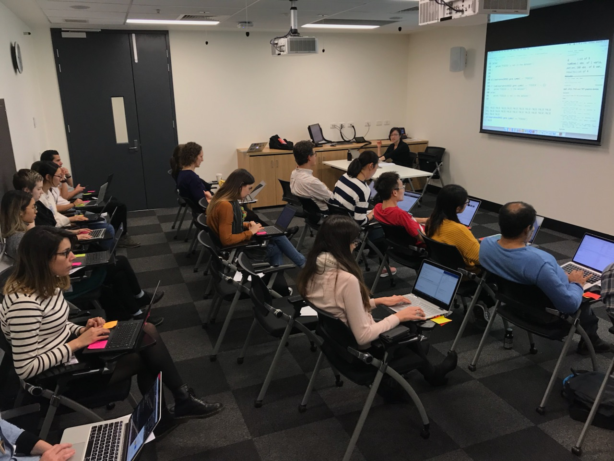

## Course Description
This course provides a practical introduction to the writing of Python programs for the complete novice. Participants are lead through the core aspects of Python illustrated by a series of example programs. Upon completion of the course, attentive participants will be able to write simple Python programs and customize more complex code to fit their needs.

## Course Objectives

After this course you should be able to:

*   Edit and run Python code
*   Write file-processing python programs that produce output to the terminal and/or external files
*   Create stand-alone python programs to process biological data
*   Know how to develop your skills in Python after the course

## Topics Covered

### Week 1
- Introduction
- Data types

### Week 2
- Conditional execution
- Loops

### Week 3
- Files
- Delimited files

### Week 4
- Case studies
- Practice

## Course Materials

### Week 1
- [Introduction](https://github.com/PMacDaSci/python-intro/blob/master/Introduction_to_python_day_1_introduction.ipynb)
- [Simple data types](https://github.com/PMacDaSci/python-intro/blob/master/Introduction_to_python_day_1_session_1.ipynb)
- [Lists and Dictionaries](https://github.com/PMacDaSci/python-intro/blob/master/Introduction_to_python_day_1_session_2.ipynb)

### Week 2
- [Conditional execution](https://github.com/PMacDaSci/python-intro/blob/master/Introduction_to_python_day_1_session_3.ipynb)
- [Loops](https://github.com/PMacDaSci/python-intro/blob/master/Introduction_to_python_day_1_session_4.ipynb)

### Week 3
- Files

### Week 4
- Case Studies/Practice

### Additional Reading
- [Additional Reading](https://github.com/PMacDaSci/python-intro/blob/master/Additional%20Reading.ipynb)

## Course Presenters

- Maria Doyle, Research Computing Facility
- Richard Lupat, Bioinformatics Core
- Miriam Yeung, Dawson Labs

## Course Helpers

*(includes all above)*

- Lara Petelin, Parkville Familial Cancer Centre

## Acknowledgements
This course is run by the Peter Mac Data Science Training team and is based on the Python course run by the [University of Cambridge](http://training.csx.cam.ac.uk/bioinformatics/course)

## Useful Resources

+ [The Python Software Foundation](https://www.python.org/)
